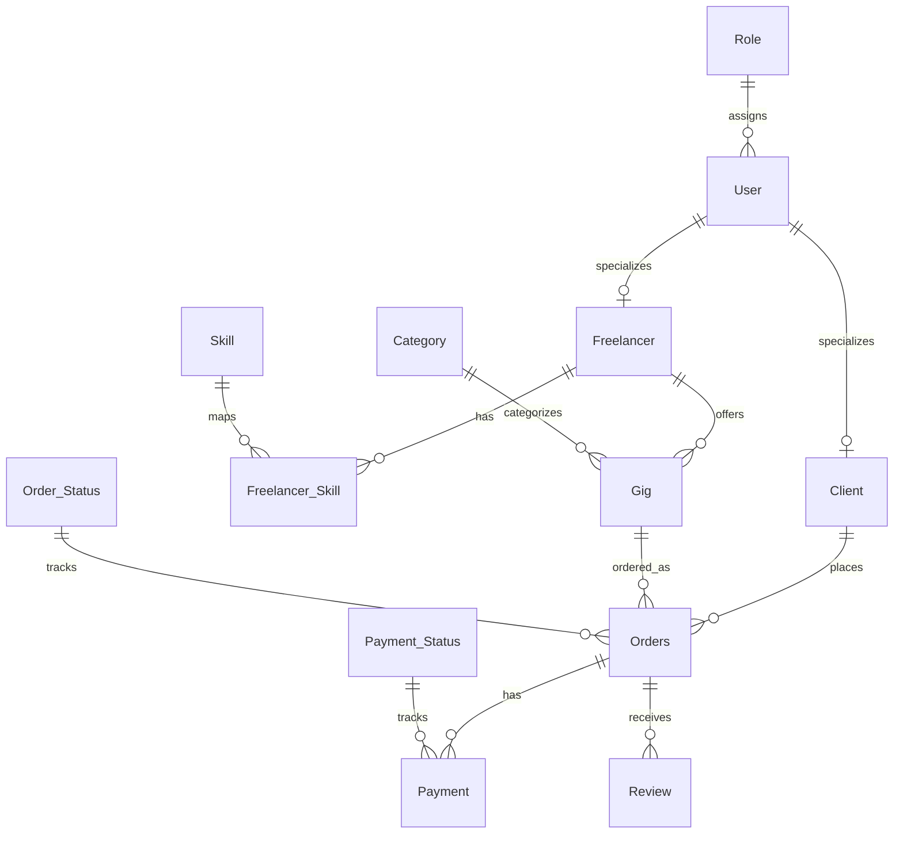

# Schema Overview

This diagram is derived from the tables and foreign keys implemented in the project SQL.

## Relationship Summary

- `Role.role_id` → `User.role_id`
- `User.user_id` → `Freelancer.user_id`
- `User.user_id` → `Client.user_id`
- `Freelancer.freelancer_id` → `Freelancer_Skill.freelancer_id`
- `Skill.skill_id` → `Freelancer_Skill.skill_id`
- `Freelancer.freelancer_id` → `Gig.freelancer_id`
- `Category.category_id` → `Gig.category_id`
- `Client.client_id` → `Orders.client_id`
- `Gig.gig_id` → `Orders.gig_id`
- `Order_Status.status_id` → `Orders.status_id`
- `Orders.order_id` → `Payment.order_id`
- `Payment_Status.payment_status_id` → `Payment.payment_status_id`
- `Orders.order_id` → `Review.order_id`
